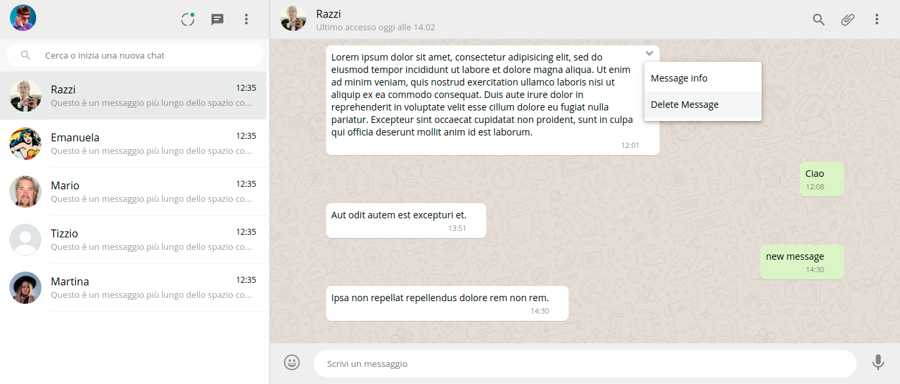

# Boolzapp

A front-End and basic functionality of a whatsapp-like app

## Laguages & Technologies
HTML, CSS, Flex,    <b>Javascript, Jquery, AJAX, Hadlebars.js </b> 

## Functionality

The web-app displays a number of contacts and their conversations with the user who can select one of the conversations, view the messages history and delete specific ones.

Using the search input on the top left side, it's possible to filter through the present conversations.

The user can also type and send a message in the conversation and a random answer gets automatically produced and displayed.

##### Details

- The texts, timestamps and types (sent or received) are stored in an array of JSON objects.
- The automatic answer is created through Ajax call to a "random sentence" API.
- The message display in the HTML code is managed by Handlebars.js

## Screenshots

Full page
 

 
